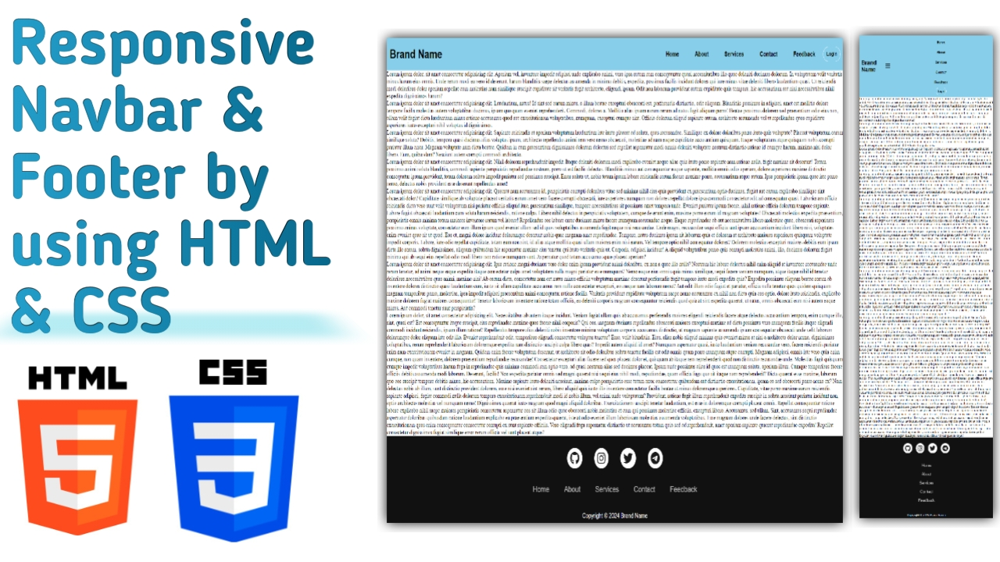

# Responsive Navbar and Footer

This project demonstrates a responsive navbar and footer built using HTML and CSS. It includes social media icons, navigation links, and a sticky navbar for better user experience across various screen sizes. The project leverages a mobile-first approach to ensure compatibility on smaller devices.

## Demo screenshot

## Live Demo

* You can check out the live demo of the project [here](https://premkrrajbhar.github.io/responsive-navbar-and-footer/)

## Table of Contents

1. [Project Overview](#project-overview)
2. [Features](#features)
3. [Technologies Used](#technologies-used)
4. [Usage](#usage)
5. [Contributing](#contributing)
6. [Contact](#contact)

## Project Overview

This project consists of a responsive navigation bar and footer with social media icons. The navbar includes the brand name, navigation links and a login button while the footer includes social media icons and additional navigation links. Both the navbar and footer adapt seamlessly to different screen sizes by using media queries.

## Features

* Responsive Navbar :

  * Sticky navbar that remains at the top while scrolling.
  * Collapsible menu on smaller screens using a hamburger icon.
  * Smooth alignment of navigation links and a login button.

* Responsive Footer :

  * Social media icons with Font Awesome integration.
  * Footer navigation links for easy access to important sections.
  * Fully responsive across all device sizes.

* Mobile-first Design :

  * Optimized for mobile devices with a collapsible navigation menu.

## Technologies Used :

* **HTML5** : For structuring the webpage.
* **CSS3** : For styling the webpage, including media queries for responsiveness.
* **Font Awesome** : For Social media icons.

## Usage 

1. **Clone the Repository** : Download or clone the project to your local machine.

2. **Open the Project** : Navigate to the project folder and open the `index.html` file in any web browser.

3. **Customization** : You can easily modify the content, add new services, or change styles by editing the `index.html` and related CSS files.

## Contributing

- If you have suggestions for improvements or bug fixes, feel free to create a pull request or open an issue.

## Contact

For any questions or comments, please reach out to :
- Email : [premkumar224487@gmail.com](mailto:premkumar224487@gmail.com)
- Github : [premkrrajbhar](https://github.com/premkrrajbhar)
